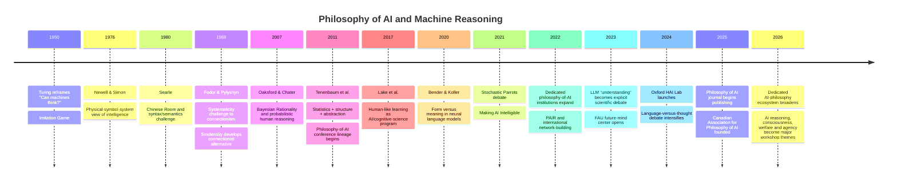
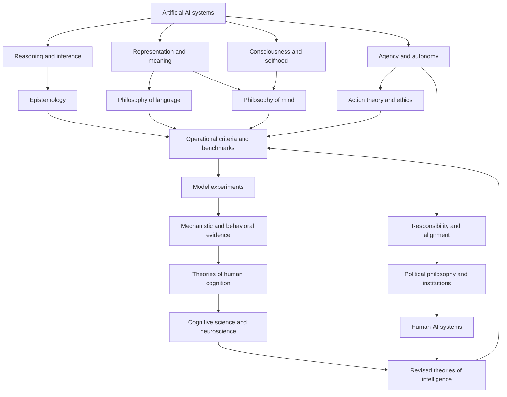

# AI Philosophy as an Emerging Research Field: Institutions, Intellectual Foundations, and Research Opportunities

## Executive summary

**Yes: there is now a recognizable international research ecosystem explicitly organized around the philosophy of artificial intelligence, although it is still institutionally young, heterogeneous, and much smaller than the adjacent field of AI ethics.** The strongest cases of centers whose names or stated missions directly foreground philosophy and AI include the **Centre for Philosophy and AI Research (PAIR)** at Friedrich-Alexander-Universität Erlangen-Nürnberg, the **Eindhoven Center for Philosophy of AI (ECPAI)**, the **Center for Philosophy of Artificial Intelligence (CPAI)** at the University of Copenhagen, Oxford's **Laboratory for Human-Centered AI (HAI Lab)**, the **AI & Humanity Lab** at the University of Hong Kong, and Florida Atlantic University's center focused on the future of mind, intelligence, and consciousness. citeturn1search1turn1search0turn10search0turn0search4turn0search7turn12search0

Around these is a wider ring of institutions in which philosophical AI research is central but shares space with ethics, political theory, cognitive science, consciousness studies, or governance: Oxford's **Institute for Ethics in AI**, Cambridge's **Leverhulme Centre for the Future of Intelligence**, Johns Hopkins' **Machine Intelligence and Normative Theory Lab (MINT)**, the University of London's **London AI and Humanity Project**, NYU's **Center for Mind, Brain, and Consciousness**, and HKUST's **AI Ethics and Governance Lab**. citeturn8search3turn8search2turn8search0turn19search0turn19search1turn10search2 Independent organizations and networks are becoming important too: the **Cosmos Institute** deliberately combines philosophical thinking with technical AI work, while the **Canadian Association for Philosophy of AI** was founded in 2025 specifically to create a national philosophy-of-AI community. citeturn5search15turn5search3turn11search0turn11search2

The institutional pattern is significant. **“Philosophy of AI” is beginning to separate conceptually from “AI ethics.”** Its central questions include what intelligence, reasoning, representation, understanding, agency, knowledge, intentionality, consciousness, and autonomy amount to in artificial systems; what current AI teaches us about those same properties in humans; and how philosophical concepts can be operationalized in computational experiments. PAIR explicitly describes its agenda as asking what AI *is, could be, and should be*; Oxford HAI connects work on reason and agency to implementation; ECPAI combines epistemology, philosophy of science, ethics, cognitive science, and AI; and Copenhagen's CPAI explicitly asks both what AI can learn from philosophy and what philosophy can learn from AI. citeturn1search5turn0search4turn1search8turn10search0

For your particular interest in **whether probabilistic systems reason**, the most important conclusion is that **stochastic or probabilistic computation is not, by itself, an argument either for or against reasoning**. A large tradition in cognitive science treats human inference itself as probabilistic, Bayesian, resource-bounded, or uncertainty-sensitive. Oaksford and Chater's *Bayesian Rationality*, Tenenbaum and colleagues' “How to Grow a Mind,” and Gershman and colleagues' work on computational rationality all reject the idea that rational human thought must consist solely in deterministic formal deduction. citeturn4search4turn18search2turn18search10 The harder philosophical question is whether a probabilistic system's internal transitions deserve interpretation as **inferences between content-bearing states that are appropriately sensitive to reasons**, rather than merely statistical transitions that happen to produce inference-like behavior.

That distinction recreates, in a new form, an older debate. Newell and Simon connected intelligence with physical symbol manipulation; Fodor and Pylyshyn argued that cognitive systematicity and productivity demand appropriately structured representations; Smolensky argued that connectionist architectures could realize a different kind of computation; Searle denied that formally correct symbol manipulation suffices for understanding. citeturn16search4turn17search0turn16search1turn16search3 Modern LLM debates add new empirical evidence rather than simply resolving those arguments. Bender and Koller distinguish linguistic form from meaning; Mitchell and Krakauer show that experts disagree about whether LLM performance warrants “understanding”; Shanahan cautions against moving uncritically from predictive mechanisms to anthropomorphic descriptions; while Mahowald and colleagues argue that LLM evidence helps separate linguistic competence from more general thought. citeturn17search3turn18search1turn14search1turn17search1

For an AI engineer entering the field, the most promising niche is therefore **not simply to write philosophical commentary about AI outputs**. It is to do *computational philosophy of AI*: define a philosophically important construct—reasoning, belief, inquiry, understanding, agency, introspection, conceptual possession, epistemic responsibility—derive discriminating empirical predictions, test them on models under controlled interventions, and use the results to refine both AI engineering and philosophical theory. Oxford HAI's “Humans In, Humans Out” and “Inquiry Complex” projects, LAIHP's benchmarking work, MINT's computational normative research, and ECPAI's work on explainability illustrate this emerging methodology. citeturn1search18turn1search22turn19search2turn8search12turn2search7

My overall assessment is that the field is at a particularly favorable stage for someone with your background: **there are now institutions and venues, but its basic concepts and experimental standards remain unsettled**. That makes philosophical sophistication combined with the ability to run model experiments unusually valuable.

## Institutional landscape

The table distinguishes centers whose missions are directly philosophy-of-AI oriented from broader centers where philosophical AI is a major component. “Interdisciplinary” here means the institution explicitly combines philosophy with fields such as computer science, cognitive science, neuroscience, psychology, political science, law, or industry research.

| Name | Location | Focus | Key people | Link |
|---|---|---|---|---|
| **Centre for Philosophy and AI Research (PAIR), FAU** | Erlangen/Nuremberg, Germany | Dedicated philosophy of AI: intelligence, mind, ethics, agency, society. **Interdisciplinary: yes.** | Vincent C. Müller, Miriam Gorr, Sascha Benjamin Fink | Primary site citeturn1search1turn2search1 |
| **Laboratory for Human-Centered AI, Oxford** | Oxford, UK | Philosophy-to-code research on reason, inquiry, agency, autonomy, human flourishing. **Interdisciplinary: strongly.** | Philipp Koralus | Primary site citeturn0search4turn2search2 |
| **Eindhoven Center for Philosophy of AI (ECPAI)** | Eindhoven, Netherlands | Epistemology, XAI, trust, creativity, alignment, nonhuman intelligence. **Interdisciplinary: yes.** | Matthew J. Dennis, Carlos Zednik, Philip J. Nickel, Filippo Santoni de Sio | Primary site citeturn1search0turn2search4 |
| **AI & Humanity Lab, HKU** | Hong Kong | Philosophy of cognition, language, agency, political philosophy, consciousness and AI. **Interdisciplinary: yes.** | Herman Cappelen, Rachel Sterken, Simon Goldstein, Boris Babic, Brian Wong | Primary site citeturn0search7turn2search3 |
| **Center for Philosophy of Artificial Intelligence (CPAI), Copenhagen** | Copenhagen, Denmark | Philosophy of cognitive science, ethics, AI safety, consciousness, democracy and AI. **Interdisciplinary: strongly.** | Anders Søgaard, Sille Obelitz Søe, Thor Grünbaum | Primary site citeturn10search0turn10search5 |
| **Center for the Future Mind / Future of AI, Mind & Society, FAU** | Boca Raton, US | Intelligence, consciousness, self, human-AI interaction and flourishing. **Interdisciplinary: strongly.** | Susan Schneider, Elan Barenholtz, Cody Turner | Primary site citeturn12search0turn12search1turn12search19 |
| **Machine Intelligence & Normative Theory Lab (MINT), Johns Hopkins** | Washington/Baltimore academic ecosystem, US | Computational + philosophical work on AI, institutions, liberal democracy and normative theory. **Interdisciplinary: strongly.** | Seth Lazar | Primary site citeturn0search23turn8search0 |
| **Oxford Institute for Ethics in AI** | Oxford, UK | Ethical and philosophical foundations of AI; human/artificial intelligence, agency, privacy, governance. **Interdisciplinary: strongly.** | Edward Harcourt, Caroline Green, Raphaël Millière, Carissa Véliz, Nigel Shadbolt | Primary site citeturn8search3turn8search7 |
| **Leverhulme Centre for the Future of Intelligence (CFI), Cambridge** | Cambridge, UK | Nature and future of intelligence, consciousness, AI risks and opportunities. **Interdisciplinary: strongly.** | Henry Shevlin and a broad humanities/science network | Primary site citeturn8search2turn8search6 |
| **London AI and Humanity Project (LAIHP)** | London, UK | AI philosophy, cognitive science, responsible AI, affect, epistemology and philosophical benchmarking. **Interdisciplinary: explicitly.** | Institute of Philosophy network; recurring contributors include Barry Smith, Alex Grzankowski and collaborators from HKU/Cambridge/DeepMind | Primary site citeturn19search0turn19search4 |
| **NYU Center for Mind, Brain, and Consciousness** | New York, US | Foundational philosophy/cognitive science of mind and consciousness, with substantial AI-consciousness and deep-learning activity. **Interdisciplinary: yes.** | Ned Block, David Chalmers | Primary site citeturn19search1turn19search10 |
| **HKUST AI Ethics & Governance Lab** | Hong Kong | AI ethics/governance with philosophy, decision theory, psychology, policy and CS; East-West philosophical approaches. **Interdisciplinary: explicitly.** | Janet Hsiao, Masaru Yarime, Yang Liu, David Haslett | Primary site citeturn10search2turn10search4 |
| **Cosmos Institute** | Independent; international | Philosophy-informed AI engineering, human flourishing, autonomy, knowledge and institutions. **Interdisciplinary: central to mission.** | Cosmos Research Group; participating philosophers include Seth Lazar | Primary site citeturn5search15turn5search7 |
| **Canadian Association for Philosophy of AI (CAPAI/ACPIA)** | Canada | National scholarly network devoted specifically to philosophy of AI. **Interdisciplinary orientation: yes.** | Martina Orlandi, Nicholas Dunn | Primary site citeturn11search0turn11search2 |
| **Google DeepMind — embedded philosophy/ethics research** | Industry; UK/global | No standalone “philosophy lab,” but substantial work in value alignment, political philosophy, communication and agency. **Interdisciplinary: yes.** | Iason Gabriel, Atoosa Kasirzadeh; Julia Haas appears in philosophy-of-AI collaborations | Primary research citeturn15search0turn15search2turn19search4 |
| **Anthropic — Character and Model Welfare research** | Industry; US | Philosophical questions about character, agency, values, consciousness, moral status and model preferences. **Interdisciplinary: yes.** | Amanda Askell; model-welfare, alignment and interpretability teams | Primary research citeturn14search0turn15search1 |

A few of these warrant more detail because their programs are unusually close to the research profile you describe.

**PAIR is probably the clearest institutional example of a center literally dedicated to “philosophy and AI.”** It was established around Vincent C. Müller's Alexander von Humboldt Professorship and describes its research in terms of philosophical theory concerning what AI is, could be, and should be. Its personnel span philosophy, cognitive science, neuroscience, computer science and social/political fields. PAIR members also built unusually substantial field infrastructure: the Society for Philosophy of AI, the *Philosophy of AI* journal, and the PhAI conference series. Recent PAIR outputs include work on sensory engineering and epistemic risk, value alignment and control, artificial minds, and forthcoming books/handbooks on the philosophy of AI. citeturn1search1turn1search5turn6search0 Its funding portfolio is also revealing of how the field can be financed: PAIR lists Humboldt, German federal and Bavarian programs, DFG, European Commission and other sources; Müller's Humboldt professorship alone was listed at €3.5 million plus matching support. citeturn1search25

**Oxford HAI is especially relevant for someone who does not want to leave technical work behind.** Founded in 2024 under Philipp Koralus, its stated model is to connect philosophical investigation with technological implementation, particularly around reason, agency and human autonomy. citeturn0search1turn2search2 The “Humans In, Humans Out” program compares LLM behavior with characteristic patterns of human reasoning—including successful and fallacious patterns—while the “Inquiry Complex” work asks whether structures corresponding to inquiry can be identified or induced in language models. Koralus' own *Reason and Inquiry* provides the philosophical background. citeturn1search18turn1search22turn2search13 This is perhaps the most obvious academic home in the survey for **philosophy-to-benchmark or philosophy-to-model** work.

**ECPAI is unusually strong on epistemology and philosophy of science.** Its research clusters include trustworthy AI, explainability, reliability, moral reasoning, trust, AI creativity, nonhuman intelligence and alignment. citeturn1search4turn1search8turn1search12 Representative publications include Emily Sullivan's work on inductive risk, understanding and opaque ML models and Carlos Zednik's work on scientific exploration and explainable AI. The center explicitly collaborates with technical AI researchers and industry, making it a natural place for work on whether model representations provide genuine scientific understanding rather than merely predictive utility. citeturn2search7

**HKU's AI & Humanity Lab is perhaps the most philosophically ambitious program outside Europe.** Herman Cappelen directs a group spanning philosophy of language, cognition, epistemology, political philosophy, statistics, law and AI. citeturn2search3 Its publication program includes Cappelen and Josh Dever's *Making AI Intelligible*, work on AI content and cognition, Simon Goldstein's work on AI safety/epistemology/language, and forthcoming work explicitly defending stronger interpretations of AI cognition. citeturn2search21 A particularly interesting 2026 initiative, **After “Consciousness”**, asks whether AI debates should replace the overloaded concept of consciousness with a more fine-grained theoretical toolkit—exactly the sort of conceptual reconstruction that philosophy can contribute when old categories are strained by new systems. citeturn2search18

**Copenhagen's CPAI explicitly treats the relationship as bidirectional: what can AI learn from philosophy, and what can philosophy learn from AI?** Its current team combines philosophy, cognitive science and computer science under Anders Søgaard and Sille Obelitz Søe, with special-interest activity in ethics and philosophy of cognitive science. citeturn10search0turn10search5 Its 2026 activity illustrates the breadth of the emerging field: a Carlsberg-funded workshop on critical perspectives on AI safety, a multidisciplinary conference on models of consciousness involving philosophy, computer science and psychology, and work on democracy and AI. citeturn10search1turn10search6turn10search8

**Florida Atlantic University's initiative is strongest at the philosophy-of-mind/consciousness end.** Susan Schneider's research spans philosophy of mind, AI, cognitive science and neuroscience; the center combines those areas with experimental cognitive science and robotics. citeturn12search1turn12search19 Its MindFest programming has directly addressed LLM understanding, personhood, agency, sentience and autonomy. citeturn12search4turn12search7 This is a good fit for questions about the metaphysics of artificial minds and what machine cognition implies for functionalism, consciousness and personal identity.

**MINT occupies a distinctive “computational normative philosophy” niche.** The lab moved from the Australian National University to Johns Hopkins in January 2025 and is led by Seth Lazar. Its mission is to combine philosophical and computational methods to understand AI-driven institutional change and preserve liberal-democratic values. citeturn0search23turn8search0 The methodological point matters: recent work such as “Blind Refusal,” accepted at CoLM 2026, experimentally investigates how language models respond to unjust or illegitimate rules rather than treating political philosophy as an after-the-fact commentary on technology. citeturn8search12

**Oxford's Institute for Ethics in AI and Cambridge CFI are broader than “AI philosophy labs,” but both are important intellectual hubs.** Oxford explicitly studies the philosophical foundations of similarities and differences between human and artificial intelligence and includes philosophers of mind, ethics and technology alongside computer scientists and governance researchers. citeturn8search15turn8search7 Cambridge CFI has long treated the nature of intelligence and consciousness—not only downstream ethics—as research questions and now sits within Cambridge's wider Institute for Technology and Humanity ecosystem. citeturn8search2turn8search14

**LAIHP is particularly interesting as a field-building mechanism.** Its stated mission brings academics and industry researchers together to study human interaction with AI. Its 2025 “Summer of AI” centered responsible AI, affect and AI, and the cognitive science of AI; it also describes a Philosophical Glossary of AI Terms and a Benchmarking Working Group intended to make philosophical concerns operational in AI assessment. citeturn19search0turn19search2 Its philosophy-of-AI summer school has involved researchers from HKU, Cambridge and Google DeepMind, demonstrating how an international AI-philosophy network is beginning to form across institutional boundaries. citeturn19search4

**NYU's Center for Mind, Brain, and Consciousness is not an AI center in name, but it is strategically important because foundational questions about AI ultimately connect to the philosophy and science of cognition.** Co-directed by Ned Block and David Chalmers, it has organized work on the philosophy of deep learning and more recently on AI welfare and moral status. citeturn19search1turn19search5turn19search6

**Cosmos is the clearest independent analogue of the academic philosophy-to-engineering movement.** It explicitly seeks technologists with philosophical depth and supports research concerning autonomy, knowledge production, institutions and human flourishing. citeturn5search15turn5search11 It launched a Cosmos Research Group in 2026 and has run fellowships and small prototype grants, making it one of the few non-university organizations where philosophy is conceived as an input into technical AI design rather than only external critique. citeturn5search7turn13search5

Finally, **industry contains significant philosophical research even where there is no organizational unit called an AI philosophy lab.** At Google DeepMind, Iason Gabriel's work ranges from value alignment to the ethics of advanced AI assistants and, in 2026, to political disagreement involving artificial minds and the idea of globally beneficial technology. citeturn15search12turn15search4turn15search0turn15search2 Anthropic has moved unusually far into questions traditionally associated with philosophy of mind and moral philosophy: its Model Welfare program explicitly asks whether AI systems could have consciousness or morally relevant experiences, while Amanda Askell's Character work and Anthropic's 2026 constitution reason in terms of virtues, judgment, values, agency, identity and uncertain moral status. citeturn15search1turn14search4turn14search0 Anthropic's 2025–26 work on model introspection, preservation and model preferences makes it a particularly striking case of philosophical questions beginning to influence actual frontier-lab practices. citeturn15search8turn15search14turn15search18

## Reasoning, probability, and theories of mind

The central question—*can a probabilistic AI system really reason?*—becomes much clearer once four issues that are often collapsed are separated.

| Level of claim | What must be established | What present-day LLM success establishes |
|---|---|---|
| **Behavioral competence** | The system reliably reaches conclusions that follow from information available to it | Sometimes strongly, although robustness and generalization vary |
| **Computational reasoning** | Its internal computation implements inferential operations rather than only task-specific associations | An empirical question requiring intervention/mechanistic evidence |
| **Semantic reasoning** | Relevant internal states possess content such that one state functions as a reason for another | Philosophically contested |
| **Mental reasoning** | The system has beliefs, intentions, understanding, agency or another genuinely mental state | Still more theoretically demanding and not settled by task performance |

This taxonomy is analytical rather than a consensus terminology, but it captures why opposing sides can look at the same experimental results and reach different conclusions. Mitchell and Krakauer explicitly document disagreement over what evidence would constitute understanding, while Shanahan argues that ordinary psychological vocabulary can mislead when applied without attention to the underlying mechanism. citeturn18search1turn14search1

### Probability is compatible with reasoning

The simplest but most important point is that **reasoning does not require deterministic computation**. Probability theory itself provides norms governing rational transitions under uncertainty, and Bayesian cognitive science has spent decades examining whether human inference approximates such norms. Oaksford and Chater's *Bayesian Rationality* explicitly advances a “probabilistic turn” in theories of human reasoning; Tenenbaum, Kemp, Griffiths and Goodman argue for cognitive models combining structured knowledge with probabilistic inference; and computational-rationality approaches treat cognition as adaptation to environmental and resource constraints. citeturn4search4turn18search2turn18search10

That creates an important asymmetry:

> **“The system samples probabilistically” is not an objection to its reasoning. “The system samples probabilistically” is also not evidence that it reasons.**

A Bayesian theorem prover, probabilistic program, particle-filtering agent or human deciding under uncertainty can plainly perform inference even when intermediate states are stochastic. The relevant question is what *organization* the probability distribution has and what role the transitions play.

This is why Tenenbaum and colleagues' framework remains important for modern AI philosophy. Their proposal did not oppose probability to symbolic structure; it tried to combine **statistics, compositional representation and abstraction**. citeturn18search2 Lake, Ullman, Tenenbaum and Gershman later argued that human-like intelligence additionally requires ingredients including intuitive theories, compositionality, causality and learning-to-learn. citeturn18search3 The conceptual alternative to contemporary deep learning is therefore not simply “symbolic/deterministic AI.” A richer distinction is between **probability over structured causal representations** and statistical prediction whose learned structure may or may not support the relevant forms of abstraction.

### The classical architecture problem has returned

Newell and Simon's physical-symbol-system tradition linked general intelligent action to operations over symbolic structures. citeturn16search4 Fodor and Pylyshyn's 1988 critique of connectionism sharpened the issue by arguing that human cognition exhibits systematicity and compositionality: someone capable of representing “John loves Mary” is systematically capable of representing structurally related thoughts such as “Mary loves John,” suggesting constituent structure in the representational system. citeturn17search0 Smolensky's connectionist response challenged the assumption that this required cognition to operate at the classical symbolic level. citeturn16search1

Transformers make that controversy empirical again. The crucial research question is no longer whether a neural network *could in principle* implement systematic representations, but **what representational and computational structure trained transformers actually acquire, how stable it is, and whether that structure explains their generalization**.

A high-value AI-philosophy project would therefore combine:

**philosophical criterion → controlled behavioral test → activation/intervention evidence → architectural comparison.**

For example, a philosophical account of systematic inference might predict that a reasoning system should preserve a relation under permutations of irrelevant lexical properties, novel variable bindings, altered surface order and counterfactual changes to premises. If a model's success disappears when such superficial properties change, the evidence for genuine structural inference weakens even when benchmark accuracy was originally high.

McCoy and colleagues' “Embers of Autoregression” is important in this respect because it demonstrates systematic behavioral signatures attributable to autoregressive processing; such evidence helps distinguish a general cognitive capacity from artifacts of a particular architecture or production procedure. citeturn18search9

### Semantics remains the deepest fault line

Bender and Koller's influential 2020 paper argues that linguistic form and meaning have to be distinguished: training only on the distribution of linguistic forms does not by itself give a learner access to communicative intentions or worldly meaning. citeturn17search3 Their argument matters more philosophically than the shorthand “stochastic parrot” metaphor because it specifies a **source-of-information argument**: what semantic information is available in a training signal, and what would justify attributing reference or understanding to the resulting states?

Searle's earlier Chinese Room argument makes a stronger philosophical claim: syntactic or formal manipulation, even when behaviorally adequate, is not sufficient for semantic understanding. citeturn16search3 Cappelen and Dever's *Making AI Intelligible* represents a different contemporary strategy: instead of requiring artificial systems to resemble human minds internally, it asks how familiar philosophical theories of content and interpretation apply to machine systems. citeturn2search21

The most promising modern version of this research question is thus not simply:

> “Does GPT understand?”

but:

> **Which theory of content would make a transformer's states contentful, what empirical commitments follows from that theory, and would the same criterion license or deny content in humans, animals, robots and other artificial systems?**

That formulation makes the philosophical stakes explicit and prevents moving the goalposts whenever an AI system gains a new capability.

### LLMs may tell us as much about human cognition as about machines

The deepest reciprocal implication concerns **language and thought**. Mahowald and colleagues argue that LLM research supports distinguishing competence in language from the broader collection of abilities ordinarily grouped under “thought.” They connect evidence from LLMs with cognitive and neuroscientific evidence that linguistic processing and nonlinguistic reasoning are partially dissociable. citeturn17search1 This is theoretically important because fluent language generation was historically easy to treat as a proxy for general conceptual intelligence.

LLMs therefore create an unusual kind of comparative cognitive science. They provide systems with:

- extremely different developmental histories from humans,
- neural rather than hand-written symbolic machinery,
- enormous linguistic exposure,
- controllable training and architecture,
- and behavior that overlaps surprisingly strongly with human linguistic behavior.

That combination can reveal which aspects of human performance really require hypotheses about embodiment, innate structure, social cognition, causal world models or domain-general reasoning. Lake and colleagues explicitly motivate human-like AI partly as a way of illuminating human minds, while the contemporary LLM literature now permits the converse experiment: determine which apparently “human” cognitive signatures arise in systems built under radically different constraints. citeturn18search3turn17search1

The major methodological warning is **behavioral underdetermination**. The same input-output regularity can result from different mechanisms. It is therefore unsafe to reason either “LLMs behave like people, so people must work like LLMs” or “LLMs were trained differently from people, so their behavior tells us nothing about human cognition.” The scientifically productive middle position is to identify *diagnostic dissociations*: cases where competing theories predict different patterns across humans and artificial systems.

A useful synthesis of the debate is:

**Probability is not the issue. Representation, structure, grounding, counterfactual robustness and reasons-responsiveness are.**

## Conferences, journals, and the development of the field

There is now sufficient infrastructure that “philosophy of AI” can function as a recognizable research community rather than merely a topic scattered across philosophy departments.

The **Society for Philosophy of AI (PhAI)** organizes a dedicated conference series whose lineage goes back to 2011 and now supports the journal *Philosophy of AI*. The journal is diamond open access, double-blind reviewed, and began publishing papers in 2025. citeturn7search7turn7search11turn7search3 **IACAP**, the International Association for Computing and Philosophy, remains an important wider home for work connecting computation and philosophy; its 2026 conference was hosted at the University of Kansas. citeturn6search9turn6search1

Among journals, **Minds and Machines** is probably the most natural established venue for work squarely joining AI, philosophy and cognitive science. citeturn7search0 **Philosophy & Technology** publishes philosophical work on AI and technology, including Luciano Floridi's argument concerning “agency without intelligence.” citeturn7search1turn7search17 **Ethics and Information Technology** is important for normative work. citeturn7search2 Philosophically substantial AI papers also routinely appear outside philosophy journals: Bender and Koller's paper appeared at ACL, Bender et al.'s “Stochastic Parrots” at FAccT, Mitchell and Krakauer in *PNAS*, Tenenbaum et al. and computational-rationality work in *Science*, and Mahowald et al. in *Trends in Cognitive Sciences*. citeturn17search3turn18search0turn18search1turn18search2turn17search1

This dispersion is not a weakness. It is evidence that the intellectual object cuts across philosophy of mind, philosophy of language, epistemology, philosophy of science, cognitive science, NLP and ML.

The dedicated summer-school/workshop layer is expanding quickly. HKU and the University of London have jointly organized Philosophy of AI summer schools; LAIHP's programs explicitly combine philosophical teaching with benchmarking and contact with researchers from Google DeepMind; Copenhagen CPAI is organizing work on AI safety and consciousness; CAPAI held its first annual conference at McGill in May 2026. citeturn19search4turn19search2turn10search1turn10search6turn11search7

### Historical trajectory

The following timeline is selective: it tracks conceptual milestones particularly relevant to the question “what does it mean for an artificial system to think or reason?” rather than attempting a general history of AI. The dates and works are supported by the original publications and current institutional histories cited below. citeturn16search0turn16search4turn16search3turn17search0turn18search2turn17search3turn18search1

The field can also be represented as a loop rather than a list of topics. The important idea is that philosophy should feed into experiment and engineering, while artificial systems feed evidence back into philosophy and cognitive science.

This feedback structure is already visible institutionally: Oxford HAI tries to move from philosophy to code; ECPAI ties epistemological concepts to XAI; MINT converts normative questions into computational studies; LAIHP explicitly works on philosophical benchmarking; and CPAI frames the relationship between AI and philosophy as bidirectional. citeturn0search4turn2search7turn8search12turn19search2turn10search0

## Gaps and promising research directions

The following are my synthesis rather than claims that any single institution has declared these to be the field's canonical open problems. They follow from the mismatch between the philosophical distinctions above and the kinds of experimental programs that the surveyed groups are beginning to develop.

**A theory and measurement framework for “reasoning.”** Current discourse too easily slides among producing a correct answer, executing a valid inference, following a rule, possessing a reason, understanding why a conclusion follows, and being an epistemically rational agent. The disagreement documented by Mitchell and Krakauer and the explicitly human-comparative work at Oxford HAI suggest that a major contribution would be a **measurement theory of machine reasoning**: a formally explicit hierarchy of competencies with interventions that distinguish memorization, heuristic completion, structured inference, causal inference, reflective revision and reasons-responsive agency. citeturn18search1turn1search18

**Connecting mechanistic interpretability to philosophical theories of content.** Mechanistic interpretability usually asks what circuits or representations causally mediate behavior. Philosophy of mind asks when such structures deserve semantic descriptions such as *belief*, *concept*, *representation* or *inference*. Bender and Koller's form/meaning argument and Cappelen and Dever's interpretational project attack this from opposite directions. citeturn17search3turn2search21 A promising program would demand that proposed content attributions survive causal interventions on the representation and support systematic counterfactual predictions.

**Discriminating reasoning from learned simulations of reasoning.** A model may have learned a distribution over textual traces generated by human reasoners. That alone does not tell us whether inference-like internal computation is responsible for the model's own output. Autoregressive signatures such as those documented by McCoy and colleagues illustrate how architecture-specific phenomena can masquerade as more general cognitive capacities. citeturn18search9 A strong project could compare direct answers, chain-of-thought-like external computation, latent reasoning, tool-assisted reasoning and recurrent/deliberative architectures under matched information conditions.

**AI as experimental philosophy of mind.** Mahowald and colleagues' dissociation of language and thought opens a broader program: use artificial systems as controlled countermodels for claims about human cognition. citeturn17search1 Does compositional language require human-like conceptual representations? Does theory of mind require embodiment? Does episodic memory require a persistent self-model? Does rational inquiry require phenomenology? Artificial systems allow partial components to be engineered or ablated in ways impossible in human experiments. The epistemic challenge is to specify exactly when an artificial counterexample bears on a theory about biological minds.

**A philosophy of inquiry rather than a philosophy of question answering.** Most current benchmarks measure whether a model can answer a supplied question. Human rationality involves deciding *what to ask*, what evidence is relevant, when uncertainty warrants investigation, when to revise one's ontology and when to stop deliberating. Koralus' inquiry-based program is unusually well aligned with this gap. citeturn2search13turn1search22 “Artificial inquiry” could become a richer theoretical unit than benchmark “reasoning.”

**Machine metacognition and self-knowledge.** Frontier systems increasingly make claims about confidence, uncertainty, preferences and internal states. Anthropic reported evidence in 2025 that it characterized as emergent introspective awareness, while explicitly noting that the mechanism remained unresolved. citeturn15search8 This creates a clean philosophical question: what separates a model *reporting learned discourse about itself* from a model having epistemically privileged access to an internal state? Work here could connect self-knowledge, higher-order representation, calibration and mechanistic intervention.

**Artificial consciousness without concept inflation.** NYU, FAU, Copenhagen, HKU and Anthropic are all now engaging questions about AI consciousness, moral status or welfare. citeturn19search6turn12search7turn10search6turn2search18turn15search1 Yet “consciousness” bundles phenomenal experience, access, reportability, self-awareness, integration, valence and many other properties. HKU's “After Consciousness” project points toward a promising strategy: decompose the construct and ask which components have empirical indicators and which carry moral significance. citeturn2search18

**Reasons-responsiveness in artificial agents.** Alignment research often asks whether behavior matches a preference or norm; philosophy of action asks whether an agent acts *for a reason*. DeepMind's value-alignment work, MINT's normative studies, Oxford HAI's agency focus and Anthropic's Character program create the pieces for a more exact science of artificial normative agency. citeturn15search12turn8search0turn0search4turn14search4 One could distinguish behavior caused by a rule representation from behavior caused *because the system treats the represented consideration as justificatory*—a difficult but foundational question.

**Human-AI joint cognition.** Philosophical work often treats “the AI” and “the human” as separate agents, while deployed systems increasingly form coupled cognitive systems: human prompts shape model trajectories; models scaffold human memory and reasoning; tools and retrieval extend both. The right unit may sometimes be a human-model-institution assemblage rather than an isolated model. Oxford's autonomy focus and Cosmos's emphasis on institutions and knowledge production are natural bases for such work. citeturn0search4turn5search11 This connects philosophy of mind to extended cognition, social epistemology and political philosophy.

**Cross-cultural and non-Anglophone philosophy of AI is conspicuously underdeveloped in the explicit institutional landscape found here.** HKUST deliberately uses an East-West and multicultural framing, and HKU has begun building a Philosophy of AI in Asia network. citeturn10search2turn9search1 By contrast, this English-language primary-source survey found few comparably visible centers with an explicit “philosophy of AI” identity in Africa, Latin America, the Middle East or large parts of continental Asia. That should be treated as a **discovery result, not evidence of absence**: the user's English-language constraint and the tendency for relevant work to be housed under ethics, STS, cognition or digital humanities create substantial search bias. Still, global variation in concepts of personhood, intelligence, autonomy and moral standing is an obvious underdeveloped research opportunity.

**The publication-methodology gap may be the most tractable opportunity of all.** Philosophy rewards conceptual argument; ML rewards experimental novelty and benchmarks. The emerging field needs papers that survive both standards. A strong template would be:

**conceptual analysis → discriminating hypotheses → reproducible model experiment → mechanistic/behavioral evidence → philosophical revision.**

The Oxford HAI, LAIHP, ECPAI and MINT programs suggest that this hybrid genre is already appearing, but it is far from standardized. citeturn1search18turn19search2turn2search7turn8search12 For an experienced AI researcher with philosophy training, this is probably the highest-leverage niche.

## Collaboration and funding

Several realistic entry paths do not require abandoning an existing technical research identity.

**For an academic collaboration centered on reasoning and cognition, Oxford HAI is the closest fit.** Its philosophy-to-code mission, current reasoning projects and openness to philosopher-technologists make it unusually compatible with a collaborator bringing model-building and evaluation experience. citeturn0search4turn1search18turn2search5 A project such as “mechanistic tests of erotetic/inquiry-based reasoning in transformers” would fit its existing intellectual program unusually closely.

**PAIR is the strongest option for embedding a project in an explicitly recognized “philosophy of AI” institutional identity.** Its seminars, reading groups, journal, conference and international funding connections mean a collaboration can simultaneously reach philosophers and AI researchers. citeturn1search29turn6search0turn1search25

**ECPAI is especially attractive for an engineering researcher interested in epistemology, explainability, model understanding or scientific use of AI.** Its work already connects philosophical theories of explanation and understanding to ML and industry practice. citeturn1search8turn2search7

**HKU is a particularly good partner for semantics, philosophy of language, artificial cognition and consciousness.** Its publication program is unusually willing to entertain substantive—not merely precautionary—claims about AI cognition, while its summer schools create natural collaboration channels with European and industry researchers. citeturn2search21turn19search4

**MINT is the best match in this survey for combining experiments on frontier models with moral or political philosophy.** The lab's accepted CoLM work demonstrates that computational work can target a recognizably philosophical question while remaining publishable in an ML venue. citeturn8search12

**LAIHP and Cosmos provide lower-friction network routes.** LAIHP has used visiting fellowships, workshops, mixers and a DeepMind symposium to connect philosophers with technical researchers. citeturn19search2 Cosmos explicitly funds philosophy-informed AI work and has a fellowship aimed at people combining advanced AI expertise with philosophical insight. citeturn13search11

The funding landscape, as of **August 18, 2026**, includes several particularly relevant sources:

| Funding/collaboration source | Why it fits | Current caveat |
|---|---|---|
| **Schmidt Sciences AI2050** | Large multidisciplinary program supporting technically ambitious work on the future of AI; fellows typically undertake two-year research projects | Treat as a recurring program rather than assuming a particular application window is open; AI2050 describes a five-year, $125M commitment and roughly 15–20 early-career fellows annually. citeturn13search0 |
| **John Templeton Foundation — Intelligence initiative** | Exceptionally good conceptual fit for comparative work on biological, synthetic, collective and artificial intelligence | The foundation's 2026 Intelligence Venture explicitly frames intelligence across natural and engineered systems. citeturn13search2 |
| **Cosmos Fellowship** | Direct fit for “AI engineer + philosopher”; includes research support, compute and network access | The site describes typical support of about $75,000/year plus travel/compute for up to one year; the fellowship was not formally open at the last captured status, though expressions of interest were welcomed. citeturn13search11 |
| **Cosmos Grants** | Useful for prototype-scale philosophy-to-code experiments and benchmarks | Grants have supported up to roughly $10,000/90-day projects; the application window with a July 26, 2026 deadline is now past. citeturn13search5turn13search8 |
| **Alexander von Humboldt / DFG / German & EU schemes through PAIR-type hosts** | Strong route for longer academic appointments and larger interdisciplinary projects | PAIR itself demonstrates successful support from Humboldt, DFG, German ministries, European sources and others. citeturn1search25 |
| **Carlsberg Foundation and analogous humanities/science foundations** | Suitable for interdisciplinary workshops and theory-building projects | Copenhagen CPAI's 2026 Critical AI Safety workshop provides a concrete example of Carlsberg support for philosophically engaged AI work. citeturn10search1 |
| **Future of Life Institute fellowships** | Relevant mainly where philosophy connects to existential safety or governance | Recent fellowship rounds are periodic rather than continuously open; the previously indexed round had closed. citeturn13search7 |

A practical collaboration strategy for your profile would be to **pitch a concrete empirical-philosophical project rather than a generic desire to “work on philosophy of AI.”** For example:

> *Can we distinguish inferential competence from probabilistic imitation by testing invariance, variable binding, belief revision and counterfactual reasons-responsiveness in open and frontier models, then relate the resulting mechanisms to Bayesian, classical and inferentialist theories of reasoning?*

That single program could plausibly connect Oxford HAI's reason/inquiry work, ECPAI's epistemology, PAIR's philosophy-of-AI infrastructure and cognitive scientists working on Bayesian or human reasoning. citeturn1search18turn1search22turn1search8turn1search5 It also has a natural dual-publication strategy: a technical paper on the experimental method and a philosophy/cognitive-science paper on what the results establish about reasoning.

## Reading roadmap

For someone who already understands modern AI engineering and already has philosophical training, I would **not** begin with broad AI-ethics surveys. The efficient route is to reconstruct the philosophical architecture debate, learn probabilistic cognitive science, then confront the contemporary LLM evidence.

| Stage | Core reading | Research purpose |
|---|---|---|
| **Foundations of machine thought** | Turing, “Computing Machinery and Intelligence”; Newell & Simon, “Computer Science as Empirical Inquiry”; Searle, “Minds, Brains, and Programs” | Separate behavioral criteria, computational theories and semantic/mental claims. citeturn16search0turn16search4turn16search3 |
| **Architecture and systematicity** | Fodor & Pylyshyn, “Connectionism and Cognitive Architecture”; Smolensky, “On the Proper Treatment of Connectionism” | Understand why compositionality and systematicity became central tests of neural cognition. citeturn17search0turn16search1 |
| **Probabilistic theories of human rationality** | Oaksford & Chater, *Bayesian Rationality*; Tenenbaum et al., “How to Grow a Mind”; Gershman et al., “Computational Rationality” | See why stochasticity and rational inference are not opposites. citeturn4search4turn18search2turn18search10 |
| **Human-like machine cognition** | Lake et al., “Building Machines That Learn and Think Like People” | Connect AI architecture to cognitive-developmental desiderata: causal models, intuitive theories, compositionality, learning-to-learn. citeturn18search3 |
| **Semantics and grounding in neural language systems** | Bender & Koller, “Climbing Towards NLU”; Cappelen & Dever, *Making AI Intelligible* | Read strong contrasting approaches to whether statistical language systems have meaning/content. citeturn17search3turn2search21 |
| **The LLM philosophical turning point** | Bender et al., “Stochastic Parrots”; Mitchell & Krakauer, “The Debate over Understanding…”; Shanahan, “Talking about Large Language Models” | Learn the strongest contemporary cautions about moving from performance to cognition. citeturn18search0turn18search1turn14search1 |
| **AI as cognitive-science evidence** | Mahowald et al., “Dissociating Language and Thought…”; McCoy et al., “Embers of Autoregression” | Learn how artificial-model behavior can bear on theories of cognitive decomposition and architecture. citeturn17search1turn18search9 |
| **Epistemology of models** | Sullivan on understanding and opaque ML; Zednik and collaborators on XAI/scientific exploration | Move from general “interpretability” rhetoric to philosophical theories of explanation and understanding. citeturn2search7 |
| **Reason and inquiry** | Koralus, *Reason and Inquiry*, followed by Oxford HAI's model experiments | Reframe reasoning as inquiry-sensitive cognition rather than merely answer production. citeturn2search13turn1search18turn1search22 |
| **Specialization** | Schneider/Chalmers for consciousness; Lazar for normative/political agency; Gabriel for values; HKU work for semantics/cognition | Choose a research axis only after the foundations above are in place. citeturn12search1turn19search1turn8search0turn15search12turn2search21 |

A useful way to turn this into active research is to pair every reading stage with a computational exercise.

For Turing/Searle, build evaluation pairs in which **behavior is held approximately constant while available grounding changes**. For Fodor/Pylyshyn, measure compositional generalization and perform interventions on hypothesized constituent representations. For Bayesian rationality, compare model responses with normative Bayesian posteriors and with human error patterns. For Bender/Koller, compare text-only, multimodal and embodied/agentic training regimes. For Mitchell/Krakauer, construct tests that force rival theories of “understanding” to make different predictions. For Mahowald, identify dissociations between linguistic competence and planning, causal inference, spatial reasoning or social cognition. These exercises convert reading into a publishable research agenda rather than a philosophy curriculum.

A researcher coming from engineering should also resist one temptation: **do not spend too long asking whether a model “really” reasons in the abstract.** Pick an account of reasoning, state its necessary or characteristic conditions, derive observable consequences, and test them. The deepest contribution will come when the experiment forces the philosophy to change—or the philosophy reveals that the standard benchmark was measuring the wrong construct.

## Primary-source bibliography

### Foundational philosophy, computation, and cognitive architecture

**Turing, A. M. (1950). “Computing Machinery and Intelligence.” *Mind* 59(236), 433–460.** The foundational reframing of “Can machines think?” in operational/behavioral terms. citeturn16search0

**Newell, A., & Simon, H. A. (1976). “Computer Science as Empirical Inquiry: Symbols and Search.” *Communications of the ACM* 19(3), 113–126.** Classic statement of the physical-symbol-system hypothesis and AI as a science of intelligent mechanisms. citeturn16search4turn16search27

**Searle, J. R. (1980). “Minds, Brains, and Programs.” *Behavioral and Brain Sciences* 3.** The Chinese Room argument against identifying formal symbol manipulation with understanding. citeturn16search3

**Fodor, J. A., & Pylyshyn, Z. W. (1988). “Connectionism and Cognitive Architecture: A Critical Analysis.” *Cognition* 28, 3–71.** The canonical systematicity/compositionality challenge to connectionist cognition. citeturn17search0turn17search16

**Smolensky, P. (1988). “On the Proper Treatment of Connectionism.” *Behavioral and Brain Sciences*.** A foundational response developing a distinct connectionist conception of cognitive computation. citeturn16search1

### Probability, rationality, and models of human intelligence

**Oaksford, M., & Chater, N. (2007). *Bayesian Rationality: The Probabilistic Approach to Human Reasoning*. Oxford University Press.** A major statement of the probabilistic turn in human reasoning theory. citeturn4search4turn4search21

**Tenenbaum, J. B., Kemp, C., Griffiths, T. L., & Goodman, N. D. (2011). “How to Grow a Mind: Statistics, Structure, and Abstraction.” *Science* 331, 1279–1285.** Integrates Bayesian inference with structured representations and abstraction. citeturn18search2

**Gershman, S. J., Horvitz, E. J., & Tenenbaum, J. B. (2015). “Computational Rationality: A Converging Paradigm for Intelligence in Brains, Minds, and Machines.” *Science*.** Connects rationality to computational and resource constraints across artificial and biological intelligence. citeturn18search10turn18search22

**Lake, B. M., Ullman, T. D., Tenenbaum, J. B., & Gershman, S. J. (2017). “Building Machines That Learn and Think Like People.” *Behavioral and Brain Sciences* 40.** A major bridge between cognitive science and AI architecture. citeturn18search3

**Griffiths, T. L., Chater, N., Tenenbaum, J. B., et al. (eds.). *Bayesian Models of Cognition*.** A recent broad synthesis of Bayesian approaches to reverse-engineering cognition. citeturn4search1

### Language models, meaning, reasoning, and understanding

**Bender, E. M., & Koller, A. (2020). “Climbing Towards NLU: On Meaning, Form, and Understanding in the Age of Data.” ACL.** A foundational argument for distinguishing distributional mastery of linguistic form from meaning. citeturn17search3

**Bender, E. M., Gebru, T., McMillan-Major, A., & Shmitchell, S. (2021). “On the Dangers of Stochastic Parrots: Can Language Models Be Too Big?” FAccT.** Broader critique of scaling language models, including epistemic and social limitations of treating fluent generation as understanding. citeturn18search0

**Cappelen, H., & Dever, J. (2021). *Making AI Intelligible: Philosophical Foundations*. Oxford University Press.** Applies theories of content and interpretation directly to AI. citeturn2search21

**Mitchell, M., & Krakauer, D. C. (2023). “The Debate over Understanding in AI's Large Language Models.” *Proceedings of the National Academy of Sciences* 120.** The best compact map of the contemporary scientific/philosophical disagreement over LLM understanding. citeturn18search1

**Shanahan, M. (2024). “Talking about Large Language Models.” *Communications of the ACM* 67(2), 68–79.** A philosophically important analysis of when intentional and anthropomorphic descriptions of LLM behavior are warranted. citeturn14search1turn14search10

**Mahowald, K., et al. (2024). “Dissociating Language and Thought in Large Language Models: A Cognitive Perspective.” *Trends in Cognitive Sciences* 28, 517–540.** Particularly important for the implications of AI for theories of human cognitive architecture. citeturn17search1

**McCoy, R. T., et al. (2024). “Embers of Autoregression Show How Large Language Models Are Shaped by the Problem They Are Trained to Solve.” *PNAS*.** Demonstrates how architectural/training characteristics can produce systematic cognitive-looking signatures. citeturn18search9

### Representative current philosophy-of-AI institutional research

**Koralus, P. (2023). *Reason and Inquiry*. Oxford University Press.** Philosophical foundation for Oxford HAI's current program connecting inquiry and reasoning to AI systems. citeturn2search13

**Oxford HAI Lab. “Humans In, Humans Out.”** Current experimental work comparing LLM and human reasoning patterns. citeturn1search18

**Oxford HAI Lab. “Inquiry Complex.”** A philosophy-to-model project investigating whether inquiry-like structures can be captured in LLMs. citeturn1search22

**Sullivan, E. “Inductive Risk, Understanding, and Opaque Machine Learning Models”; related work on understanding from ML models.** Representative of ECPAI's epistemology-of-machine-learning program. citeturn2search7

**Zednik, C., and collaborators. Work on scientific exploration and explainable AI.** Representative of attempts to connect philosophical explanation with XAI practice. citeturn2search7

**Cappelen, H., and collaborators. Current AI cognition, interpretationalism and artificial-content projects.** HKU's publication program is one of the strongest sources for contemporary analytic philosophy treating AI cognition as a first-order philosophical problem. citeturn2search21

**Pattison, E., Manuali, P., & Lazar, S. “Blind Refusal: Language Models Refuse to Help Users Evade Unjust, Absurd, and Illegitimate Rules.” CoLM 2026.** An example of computational experiments directly informed by normative and political philosophy. citeturn8search12

**Gabriel, I. (2020). “Artificial Intelligence, Values and Alignment.”** A philosophically explicit treatment of the distinction between technical and normative dimensions of alignment. citeturn15search12

**Gabriel, I., Manzini, A., et al. (2024). Work on the ethics of advanced AI assistants.** Connects agency, human interests, values and increasingly autonomous assistants. citeturn15search4

**Bales, A., & Gabriel, I. (2026). “Artificial Minds, Human Disagreement: The Politics of AI …”** Illustrates the expansion of industry philosophy research from alignment toward political relations involving artificial minds. citeturn15search0

**Gabriel, I., & Kasirzadeh, A. (2026). “The Case for Globally Beneficial Technology.”** A recent example of philosophy and normative theory within frontier-industry AI research. citeturn15search2

**Anthropic (2025). “Exploring Model Welfare.”** A primary industry statement launching research on whether AI systems might possess morally relevant experiences and how such uncertainty should affect practice. citeturn15search1

**Anthropic (2025). “Emergent Introspective Awareness in Large Language Models.”** Particularly relevant to philosophical theories of metacognition and self-knowledge, while explicitly leaving the underlying mechanism open. citeturn15search8

**Anthropic (2026). *Claude's Constitution*.** A rare frontier-lab primary document explicitly reasoning about artificial character, ethical judgment, autonomy, moral uncertainty, identity and possible moral status. citeturn14search0turn14search2

### Primary institutional and field sources

**PAIR, FAU — research, people, publications, grants and Philosophy of AI infrastructure.** citeturn1search1turn1search5turn2search1turn6search0turn1search25

**Oxford Laboratory for Human-Centered AI — mission, projects and personnel.** citeturn0search4turn2search2turn1search18turn1search22

**Eindhoven Center for Philosophy of AI — people, research clusters and publications.** citeturn1search0turn2search4turn1search8turn2search7

**University of Hong Kong AI & Humanity Lab — people, publications, events and research program.** citeturn2search3turn2search21turn2search18turn1search11

**University of Copenhagen Center for Philosophy of Artificial Intelligence — mission, team and 2026 programs.** citeturn10search0turn10search5turn10search1turn10search6

**Florida Atlantic University — Center for the Future Mind / AI, Mind & Society initiative.** citeturn12search0turn12search1turn12search19

**Johns Hopkins MINT Lab — mission and computational normative research.** citeturn8search0turn8search12

**Oxford Institute for Ethics in AI — research mission and personnel.** citeturn8search3turn8search15turn8search7

**Leverhulme Centre for the Future of Intelligence, Cambridge — research mission and interdisciplinary structure.** citeturn8search2turn8search6turn8search14

**London AI and Humanity Project — mission, benchmarking initiatives and Philosophy of AI summer programs.** citeturn19search0turn19search2turn19search4

**NYU Center for Mind, Brain, and Consciousness — people and AI/deep-learning/consciousness programs.** citeturn19search1turn19search5turn19search6

**HKUST AI Ethics & Governance Lab — interdisciplinary and cross-cultural research agenda.** citeturn10search2turn10search4

**Cosmos Institute — research mission, fellowship and grants.** citeturn5search15turn5search11turn13search11turn13search5

**Canadian Association for Philosophy of AI — founding and scholarly mission.** citeturn11search0turn11search2turn11search7

**Society for Philosophy of AI / *Philosophy of AI* — conference and journal infrastructure.** citeturn7search7turn7search11turn7search3

Taken together, these sources show a field moving from a long-standing philosophical question—**whether an artificial mechanism can think**—toward a new experimental discipline concerned with **which kinds of artificial computation instantiate which kinds of cognition, how we could know, and what those artificial cases teach us about the architecture and nature of human minds**. The distinctive opportunity of the present period is that those questions can increasingly be investigated not only by argument, but by building, manipulating, comparing and interpreting the systems themselves. citeturn16search0turn18search3turn1search18turn19search2